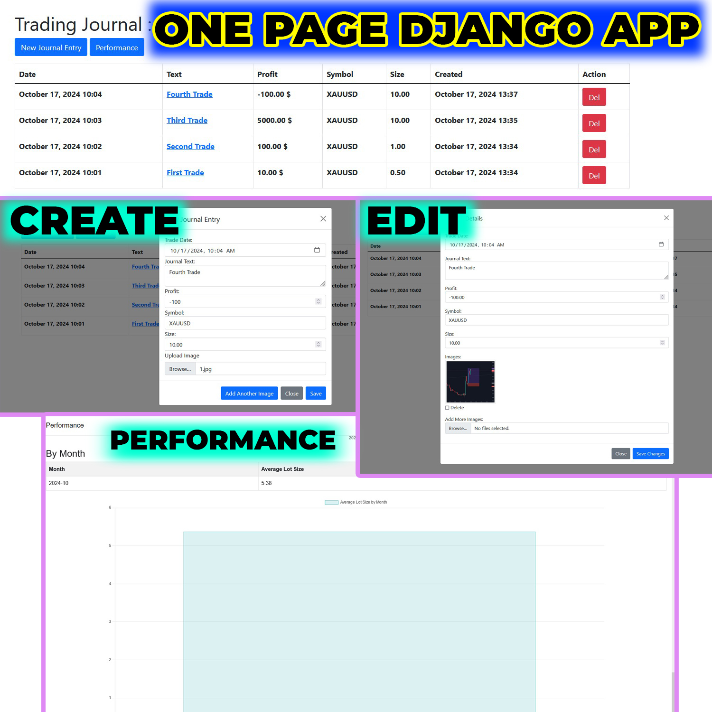

# One Page Trading Journal Django App

----

---
# Main Porpuses of this app:

- Create a One Page App! (ofcourse)
- Render A Page to Another Page
- Work With Editing And Their Functionality
- Work With Modal
- Ajax

---

# Todo:

- Create Rest Api to Work With 3rd Party Journal Creators
- Users Can Have Multiple Journal With A Unique ID
- Users Can Set their Journal to Public or Grant Permission to a Specific User
- User Profile

---

## 📞 Contact

[Hassan Safari] - Telegram : @safari_trader - info@global-fxs.com